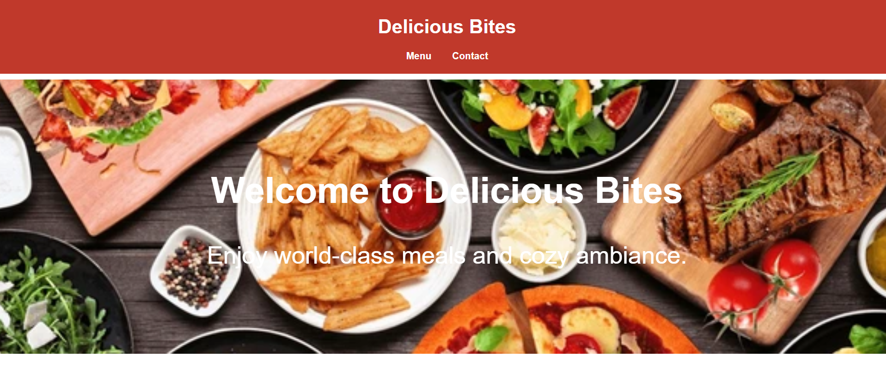

# Ex.07 Restaurant Website
# Date:6:10:2025
# AIM:
To develop a static Restaurant website to display the food items and services provided by them.

# DESIGN STEPS:
## Step 1:
Requirement collection.

## Step 2:
Creating the layout using HTML and CSS.

## Step 3:
Updating the sample content.

## Step 4:
Choose the appropriate style and color scheme.

## Step 5:
Validate the layout in various browsers.

## Step 6:
Validate the HTML code.

## Step 7:
Publish the website in the given URL.

# PROGRAM:
```
administration.html
<!DOCTYPE html>
<html lang="en">
<head>
  <meta charset="UTF-8" />
  <meta name="viewport" content="width=device-width, initial-scale=1.0"/>
  <title>Delicious Bites</title>
  <style>
    body {
  font-family: 'Arial', sans-serif;
  margin: 0;
  padding: 0;
  background: #fff;
  color: #333;
}

header {
  background: #c0392b;
  color: white;
  padding: 20px;
  text-align: center;
}

nav a {
  color: white;
  margin: 0 15px;
  text-decoration: none;
  font-weight: bold;
}

.hero {
  background: url('https://www.shutterstock.com/image-photo/table-scene-assorted-delicious-foods-600nw-2273477157.jpg') no-repeat center center/cover;
  color: white;
  padding: 100px 20px;
  text-align: center;
  font-size: 40px;
  margin-top: 10px;
}

#menu {
  padding: 50px 20px;
  background: #f4f4f4;
  text-align: center;
}

.menu-items {
  display: flex;
  flex-wrap: wrap;
  justify-content: center;
  gap: 30px;
  margin-top: 30px;
}

.item {
  background: white;
  padding: 15px;
  border-radius: 10px;
  box-shadow: 0 0 10px rgba(0,0,0,0.1);
  width: 280px;
}

.item img {
  width: 100%;
  border-radius: 8px;
  height: 200px;
  object-fit: cover;
}

#contact {
  padding: 40px 20px;
  text-align: center;
}

form {
  max-width: 500px;
  margin: auto;
  display: flex;
  flex-direction: column;
  gap: 15px;
}

form input, form textarea {
  padding: 10px;
  border: 1px solid #ccc;
  border-radius: 6px;
  font-size: 16px;
}

button {
  background: #c0392b;
  color: white;
  padding: 12px;
  border: none;
  border-radius: 6px;
  font-size: 16px;
  cursor: pointer;
}

footer {
  background: #222;
  color: white;
  text-align: center;
  padding: 10px;
  margin-top: 60px;
}

  </style>
</head>
<body>
  <header>
    <h1>Delicious Bites</h1>
    <nav>
      <a href="menu.html">Menu</a>
      <a href="contact.html">Contact</a>
    </nav>
  </header>

  <section class="hero">
    <h2>Welcome to Delicious Bites</h2>
    <p>Enjoy world-class meals and cozy ambiance.</p>
  </section>


  <footer>
    <p>&copy; 2025 Delicious Bites. All rights reserved.</p>
  </footer>
</body>
</html>
contact.html
<!DOCTYPE html>
<html lang="en">
<head>
    <meta charset="UTF-8">
    <meta name="viewport" content="width=device-width, initial-scale=1.0">
    <title>Document</title>
    <style>
        #contact {
  padding: 40px 20px;
  text-align: center;
}

form {
  max-width: 500px;
  margin: auto;
  display: flex;
  flex-direction: column;
  gap: 15px;
}

form input, form textarea {
  padding: 10px;
  border: 1px solid #ccc;
  border-radius: 6px;
  font-size: 16px;
}

button {
  background: #c0392b;
  color: white;
  padding: 12px;
  border: none;
  border-radius: 6px;
  font-size: 16px;
  cursor: pointer;
}

footer {
  background: #222;
  color: white;
  text-align: center;
  padding: 10px;
  margin-top: 200px;
}

    </style>
</head>
<body>
    <section id="contact">
        <h2>Contact Us</h2>
        <form>
          <input type="text" placeholder="Your Name" required />
          <input type="email" placeholder="Your Email" required />
          <textarea placeholder="Your Message"></textarea>
          <button type="submit">Send Message</button>
        </form>
      </section>
    
      <footer>
        <p>&copy; 2025 Delicious Bites. All rights reserved.</p>
      </footer>
</body>
</html>
menu.html
<!DOCTYPE html>
<html lang="en">
<head>
    <meta charset="UTF-8">
    <meta name="viewport" content="width=device-width, initial-scale=1.0">
    <title>Document</title>
    <style>
        #menu {
  padding: 50px 20px;
  background: #f4f4f4;
  text-align: center;
}

.menu-items {
  display: flex;
  flex-wrap: wrap;
  justify-content: center;
  gap: 30px;
  margin-top: 30px;
}

.item {
  background: white;
  padding: 15px;
  border-radius: 10px;
  box-shadow: 0 0 10px rgba(0,0,0,0.1);
  width: 280px;
}

.item img {
  width: 100%;
  border-radius: 8px;
  height: 200px;
  object-fit: cover;
}

footer {
  background: #222;
  color: white;
  text-align: center;
  padding: 10px;
  margin-top: 100px;
}

    </style>
</head>
<body>
    <section id="menu">
        <h2>Our Menu</h2>
        <div class="menu-items">
          <div class="item">
            
            <h3>Pizza</h3>
            <p>Classic Margherita with fresh mozzarella.</p>
          </div>
          <div class="item">
            
            <h3>Burger</h3>
            <p>Juicy grilled chicken burger with fries.</p>
          </div>
          
        </div>
      </section>
    
      <footer>
        <p>&copy; 2025 Delicious Bites. All rights reserved.</p>
      </footer>
</body>
</html>

```

# OUTPUT:

 
# RESULT:
The program for designing software company website using HTML and CSS is completed successfully.
